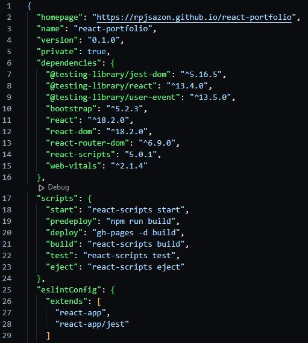
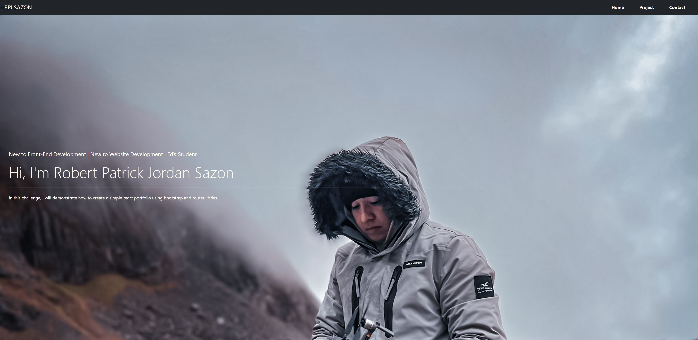
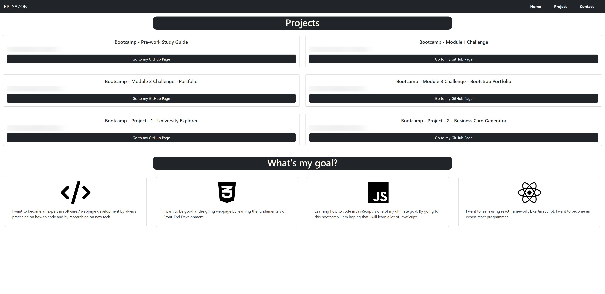
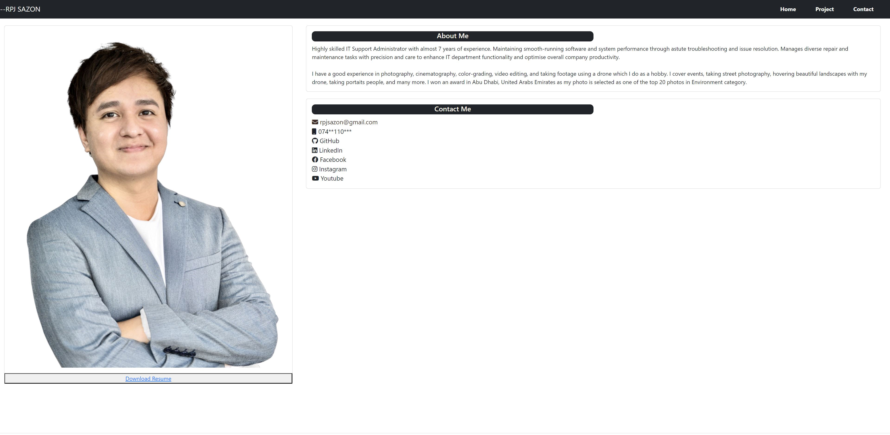

# React Portfolio

## Description

In this challenge, I will demonstrate how to create a simple react portfolio using bootstrap and router libries.
g

## Installation

```
  git clone "git@github.com:rpjsazon/react-portfolio.git"
  cd react-portfolio
  npm install
```

## Screenshots











## Usage

```
  npm start
```


## Contributing

1. Fork the Project
2. Create your Feature Branch (git checkout -b feature/AmazingFeature)
3. Commit your Changes (git commit -m 'Add some AmazingFeature')
4. Push to the Branch (git push origin feature/AmazingFeature)
5. Open a Pull Request

## License

Distributed under the MIT License. 

## Links

[Deployed Site](https://rpjsazon.github.io/react-portfolio/)


## Authors

[rpjsazon](https://github.com/rpjsazon)
